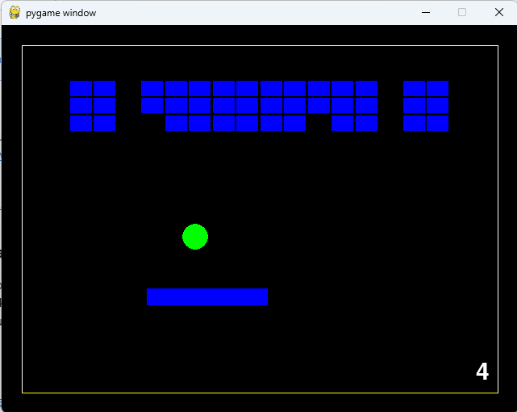

# Jogo de breakout em Python

Este jogo produzido em python é uma versão do clássico "breakout". Onde, o objetivo é 
acertar todos os quadradinhos que ficam na parte de cima do tabuleiro com uma bolinha 
que se movimenta em linha reta e pode ter seu ângulo de direção alterado por uma raquete.

[]

## Como rodar?

Para rodar o jogo, basta ter no computador o interpretador python e instalar a biblioteca "pygame'. 
Necessária para a parte gráfica do jogo.

Para instalar o pygame, basta executar o seguinte comando:

```
pip install pygame
```

Para rodar o jogo basta navegar até a raiz do projeto e executar:

```
python breakout.py
```

## Como jogar?

Para jogar, basta utilizar as setas do teclado para mover a raquete para a esquerda ou 
direita e rebater a bolinha na direção dos quadradinhos para destruí-los. O objetivo é 
destruir todos os quadradinhos! Você tem 5 tentativas que são diminuidas conforme a 
bolinha atinge a parte de baixo do tabuleiro.

A raquete tem três tipos de direcionamento da bolinha. Se a bolinha acertar a parte de cima 
da raquete, então, se dividirmos a raquete em três partes, a primeira parte reduz em 15° o 
ângulo da direção final, a segunda parte apenas rebate na direção final correta e a terceira, 
aumenta em 15° o ângulo da direção final da bolinha.

Pressione ESC para reiniciar o jogo e ENTER para pausar/continuar.

## Desafios do desenvolvimento do jogo

Um grande desafio desse jogo é determinar a colisão entre a bolinha e as paredes, quadradinhos e 
raquete do jogo para, dada a ocorrência da colisão, direcionar a bolinha na direção certa. A bolinha 
deve se movimentar em linha reta e o ângulo representa a direção da bolinha que pode ser alterado 
com a colisão com algum objeto.

Foi utilizada a equação paramétrica da reta para determinar o trajeto que a bolinha 
deve percorrer. A equação da reta foi utilizada para determinar o ponto de colisão entre 
a bolinha e a raquete.

## Considerações finais

Esse jogo deu mais trabalho que eu estava prevendo. Mas, finalmente, consegui implementar. Espero que 
gostem, baixem e rodem o script aí!